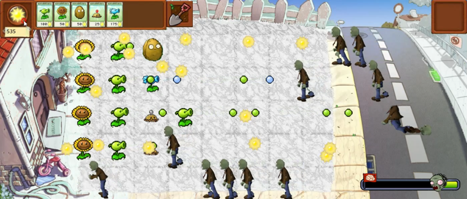

# Plants vs Zombies
> '2D게임프로그래밍' 강의를 들으며 진행한 게임 개발 프로젝트 입니다.

python

'식물 대 좀비'를 모티브로 한 게임으로 식물을 심어 좀비로부터 집을 지키는 디펜스 게임입니다.

## 설치 방법

install 폴더 안에 있는 plants_vs_zombies.exe 파일로 설치 할 수 있습니다.

사용자 계정 컨트롤 박스가 뜨면 '예'를 클릭해주세요.

## 게임 플레이

1. 대기화면에서 스페이스 바를 누르면 게임이 시작되고 게임은 마우스로만 플레이 됩니다.
2. 맵은 총 3가지로 상단의 숫자키 '1', '2', '3'을 누르면 변경할 수 있습니다.
3. 게임이 시작되면 태양에너지를 모아 식물을 심을 수 있습니다. 만약 잘못 심었다면 삽을 통해 식물을 다시 파낼 수 있습니다.
4. 식물마다 소모되는 태양에너지가 다르고 태양에너지는 오직 해바라기 식물을 통해 모을 수 있습니다.
5. 제한 시간 동안 좀비를 막아 집을 지키면 승리하고 만약 지키지 못하면 좀비의 승리입니다.

## 플레이 영상
[![][youtube-image]][play-url]

<!-- Markdown link & img dfn's -->
[youtube-image]: https://cdn.iconscout.com/icon/free/png-256/youtube-86-226404.png
[play-url]: https://www.youtube.com/watch?v=22TxMZaX9mk
