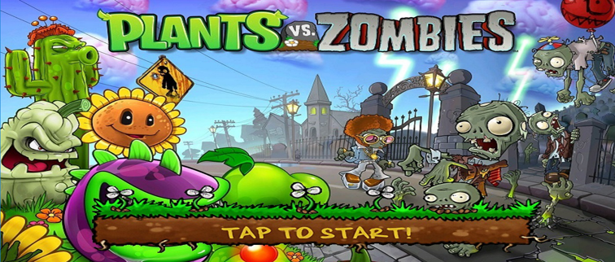
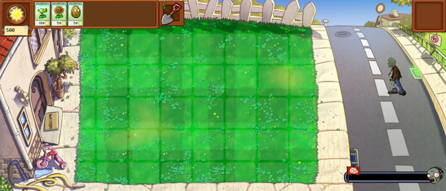
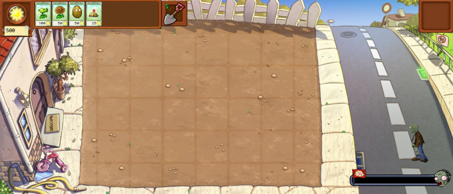

# Plants vs Zombies
> 2016-2 '2D게임프로그래밍' 강의를 들으며 진행한 게임 개발 프로젝트입니다.

'식물 대 좀비'를 모티브로 한 게임으로 식물을 심어 좀비로부터 집을 지키는 디펜스 게임입니다.
* python
* game development

## 설치 방법

install 폴더 안에 있는 plants_vs_zombies.exe 파일로 설치 할 수 있습니다.

사용자 계정 컨트롤 박스가 뜨면 '예'를 클릭해주세요.

## 게임 플레이
1. Title
* 스페이스 바를 누르면 게임이 시작되고 게임은 마우스로만 진행됩니다.

2. In Game

2-1. Map
* 3단계의 스테이지로 구성되어 있으며 상단의 숫자키 '1', '2', '3'을 누르면 변경할 수 있습니다.
* 스테이지가 올라갈수록 생성 가능한 식물의 수가 증가합니다.

2-2. Game
* 게임이 시작되면 태양에너지를 모아 식물을 심을 수 있습니다. 만약 잘못 심었다면 삽을 통해 식물을 다시 파낼 수 있습니다.
* 식물마다 소모되는 태양에너지가 다르고 태양에너지는 오직 해바라기 식물을 통해 모을 수 있습니다.
* 제한 시간 동안 좀비를 막아 집을 지키면 승리하고 만약 지키지 못하면 좀비의 승리입니다.

## 플레이 영상
[![][youtube-image]][play-url]

<!-- Markdown link & img dfn's -->
[youtube-image]: https://encrypted-tbn0.gstatic.com/images?q=tbn%3AANd9GcQ0W15QOoCkGdmGAT4yoszK-lomT0IYZmOkZ_m_cGhQJEoHyY-Z&usqp=CAU
[play-url]: https://www.youtube.com/watch?v=22TxMZaX9mk
